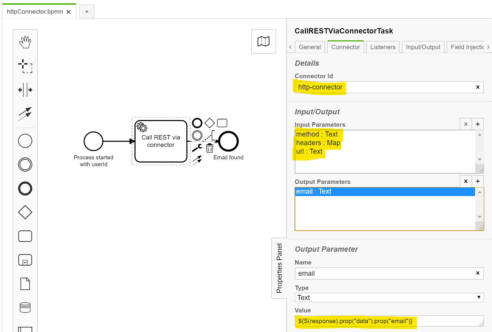

# Camunda BPM http connector usage example  

This example illustrates the invocation of a REST service from a service task in Camunda BPM using the http connector.
The example uses a Camunda [Spring Boot deployment](https://docs.camunda.org/manual/latest/user-guide/spring-boot-integration/) but should work in the same way on other dpeloyments.
 
No Java code is required. If you are comfortable with some Java / Spring then the recommended approach is to use a Spring bean instead of the connector, 
as shown in the example [rest-service-task-spring](https://github.com/camunda-consulting/code/tree/master/snippets/rest-service-task-spring).
Spring beans are more flexible, e.g. allow to add custom error handling, and are easier testable.

The service invoked by the example is hosted at [reqres.in](https://reqres.in/). Many thanks to Ben Howdle for providing this developer playground.

This example also illustrates how to 
- configure the connector
- add the value of a process variable as parameter to the url
- read a specific field from the REST service's  JSON response using Camunda Spin
- test the process from jUnit using [Camunda BPM Assert](https://docs.camunda.org/manual/latest/user-guide/testing/#camunda-assertions) 


## The important parts
On the service task set the implementataion to "Connector". The set the connector properties (method, headers, url) on the appearing tab as shown.
A response of type JSON can be read and navigated using JavaScript or an expression (shown).
[BPMN Process](src/main/resources/httpConnector.bpmn)




The prepackaged distribution includes everything needed. 

If you are starting form a Spring Boot project, you need to include the dependencies for connect, http-client, Spin and Json: 
```xml
   <dependencies>
...
    <dependency>
            <groupId>org.camunda.bpm</groupId>
            <artifactId>camunda-engine-plugin-connect</artifactId>
        </dependency>
        <dependency>
            <groupId>org.camunda.connect</groupId>
            <artifactId>camunda-connect-http-client</artifactId>
        </dependency>
        <dependency>
            <groupId>org.camunda.bpm</groupId>
            <artifactId>camunda-engine-plugin-spin</artifactId>
        </dependency>
        <dependency>
            <groupId>org.camunda.spin</groupId>
            <artifactId>camunda-spin-dataformat-json-jackson</artifactId>
        </dependency>
...
    </dependencies>
```

### Unit Test
Run the [jUnit test](src/test/java/processtest/ProcessUnitTest) in your IDE or using:
```
mvn clean test
```

### Step through the process manually 
You can start the server using your IDE or 
```
mvn spring-boot:run
```
and step through the process manually. After the server has started you can access the Camunda tasklist via http://localhost:8080/app/tasklist.
Use the credentials *demo / demo* to login.


### Run and inspect with Tasklist and Cockpit
Use tasklist and cockpit as described in the product documentation for
- [Camunda Tasklist](https://docs.camunda.org/manual/latest/webapps/tasklist)
- [Camunda Cockpit](https://docs.camunda.org/manual/latest/webapps/cockpit)


## License
[Apache License, Version 2.0](http://www.apache.org/licenses/LICENSE-2.0).